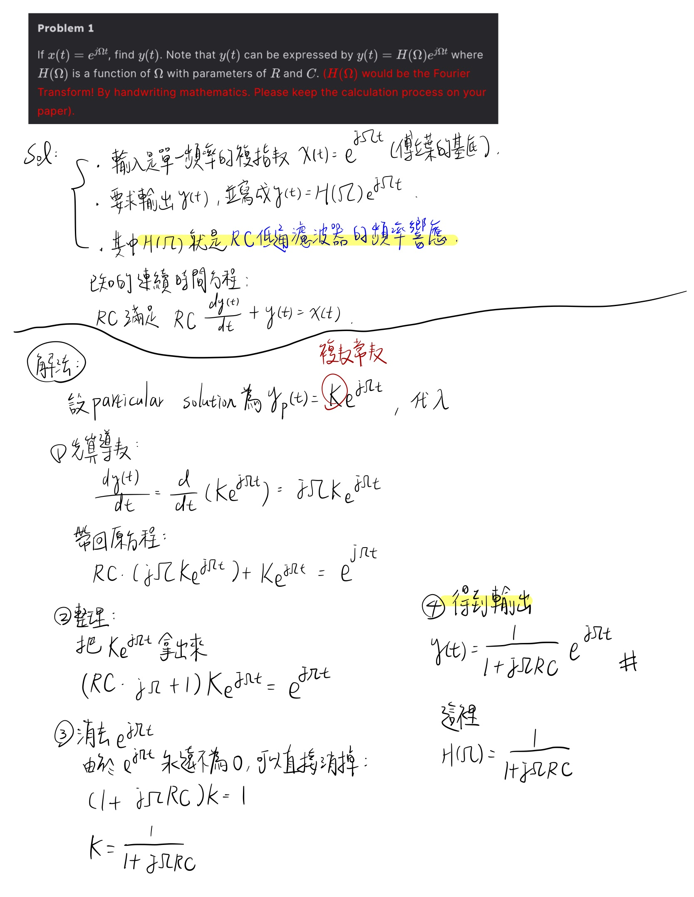

#  Digital Signal Processing Class
**DSP Assignment-1: Simulation of RC Low-Pass Filter by Discrete Signal Processing**  
Author: *711383110 唐宏碩*  
Date: *2025/10/2*  

---

## 📘 Problem 1 – Continuous-Time Response

####  Handwritten Solution

  
   

### Problem 1 — Continuous-Time Response

已知輸入為 \(x(t)=e^{j\Omega t}\)，求輸出 \(y(t)\)，並寫成  
\(y(t)=H(\Omega)e^{j\Omega t}\)。

其中 \(H(\Omega)\) 為 RC 低通濾波器的頻率響應。

---

**連續時間方程式：**
$$
RC\,\frac{dy(t)}{dt}+y(t)=x(t)
$$

---

#### 解法：

設特解為
$$
y_p(t)=K\,e^{j\Omega t}.
$$

① 先對 \(y_p(t)\) 微分：
$$
\frac{dy(t)}{dt}
  =\frac{d}{dt}\!\left(K e^{j\Omega t}\right)
  =j\Omega K e^{j\Omega t}.
$$

---

② 代回原方程：
$$
RC\!\left(j\Omega K e^{j\Omega t}\right)+K e^{j\Omega t}
   =e^{j\Omega t}.
$$

---

③ 整理後取出 \(K e^{j\Omega t}\)：
$$
(RC\,j\Omega+1)\,K e^{j\Omega t}=e^{j\Omega t}.
$$

---

④ 消去 \(e^{j\Omega t}\)，求得 \(K\)：
$$
(1+j\Omega RC)\,K=1
   \;\Rightarrow\;
   K=\frac{1}{1+j\Omega RC}.
$$

---

#### 最終輸出：
$$
\boxed{\,y(t)=\frac{1}{1+j\Omega RC}\,e^{j\Omega t}\,}
$$

因此系統的頻率響應為：
$$
\boxed{\,H(\Omega)=\frac{1}{1+j\Omega RC}\,}
$$
